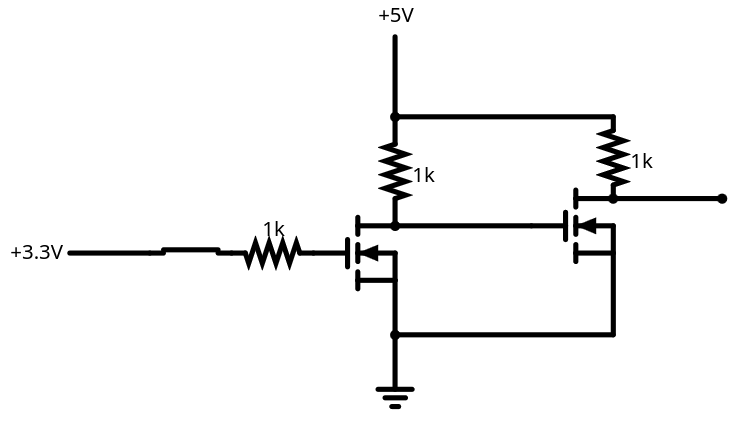

# Controll your 8x8x8 LED-Cude with a raspberry pi pico
This Repository contains the software for the RPI pico (pi-software/led-cube-controller) and animation client software (pi-software/).

# Beware
## Requirements
1.
The Cube must run the 8x8x8-LED Cube **Firmware by Sliicy** (https://github.com/Sliicy/8x8x8-LED) based on tomazas firmware (https://github.com/tomazas/ledcube8x8x8)

You can flash the firmare with stcgal (https://github.com/grigorig/stcgal) on linux or with the original cube flashing tool as described by tomazas in https://github.com/tomazas/ledcube8x8x8.

The firmware by Sliicy is also present in this repository as "cube-firmware.ihx".

2.
Since the RPI Pico runs UART only on 3.3V and the Cube expects 5.5V you need a level Shifter. Lukily the pico has a 5V VCC, so the shifter can be build with two 2N7000 Mosfets:

Please note that this is just the solution i took and the level shifter can be build totally different.