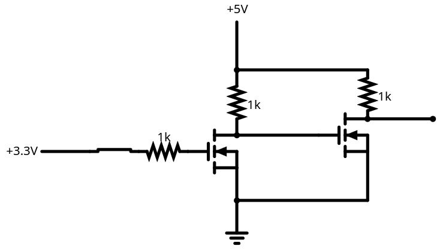

# Controll your 8x8x8 LED-Cude with a raspberry RPI Pico
This Repository contains the software for the RPI Pico (pi-software/led-cube-controller) and animation client software (pi-software/).

# Demo video running a clock on the cube
**The cube is fully controlled by the RPI Pico, there is no third device and no separate power source required.**

https://github.com/user-attachments/assets/f6a6a328-b148-4355-b01b-5f05be200dbe

# Beware
## Requirements
1.
The Cube must run either the original 8x8x8-LED Cube **Firmware by Sliicy** (https://github.com/Sliicy/8x8x8-LED) based on tomazas firmware (https://github.com/tomazas/ledcube8x8x8) or my modified Version located in [cube-firmware](https://github.com/HRDHRD5/remote-led-cube/tree/main/cube-firmware).
I highly recommend the modified version, as I optimized the firmware and also fixed a bug that caused a lot of trouble for me.

The firmware by Sliicy is also present in this repository in [cube-firmware](https://github.com/HRDHRD5/remote-led-cube/tree/main/cube-firmware).

You can flash the firmware with stcgal (https://github.com/grigorig/stcgal) on linux or with the original cube flashing tool as described by tomazas in https://github.com/tomazas/ledcube8x8x8.

2.
Since the RPI Pico runs UART only on 3.3V and the Cube expects 5.5V you need a level Shifter. Luckily the pico has a 5V VCC, so the shifter can be build with two 2N7000 Mosfets:

Please note that this is just the solution i took and the level shifter can be build totally different.

## Its pretty hacky
Things are working reliably, but its probably obvious that there is not much documentation in this repository.
If you are trying to build such a clock yourself, but have trouble figuring things out, feel free to open an issue. :)
